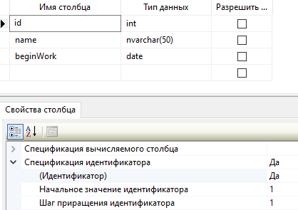
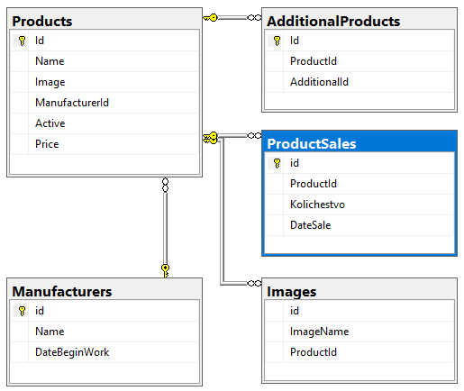
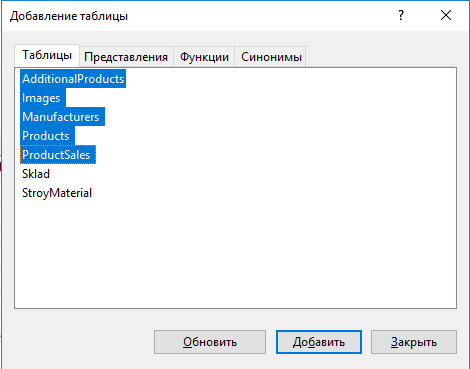
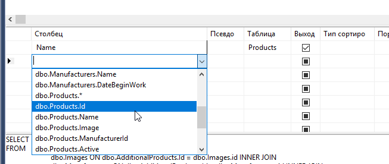
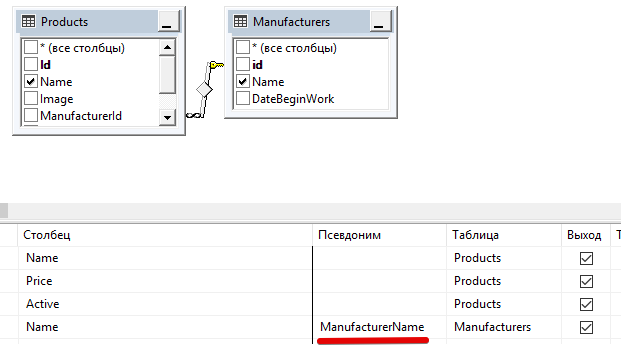
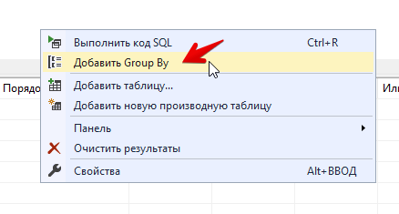
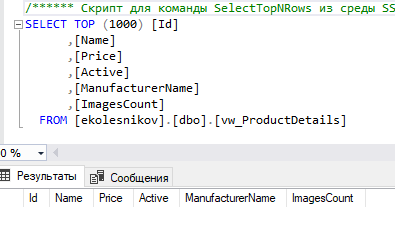
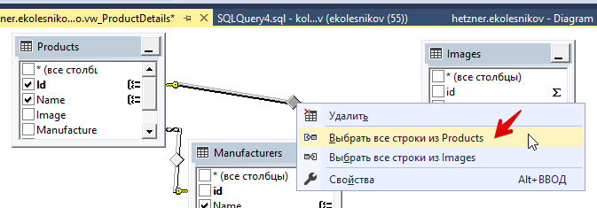
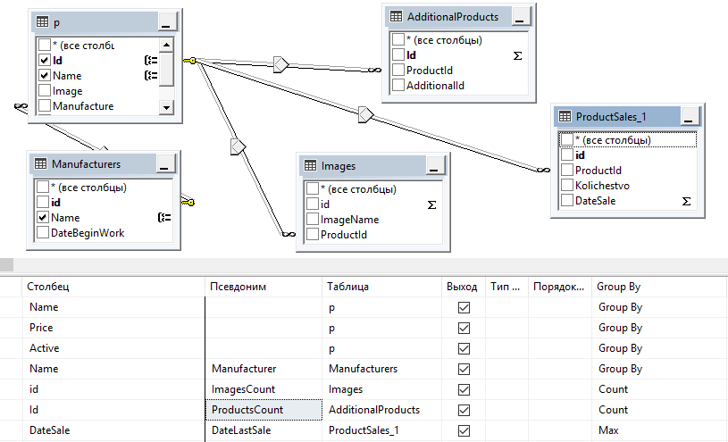
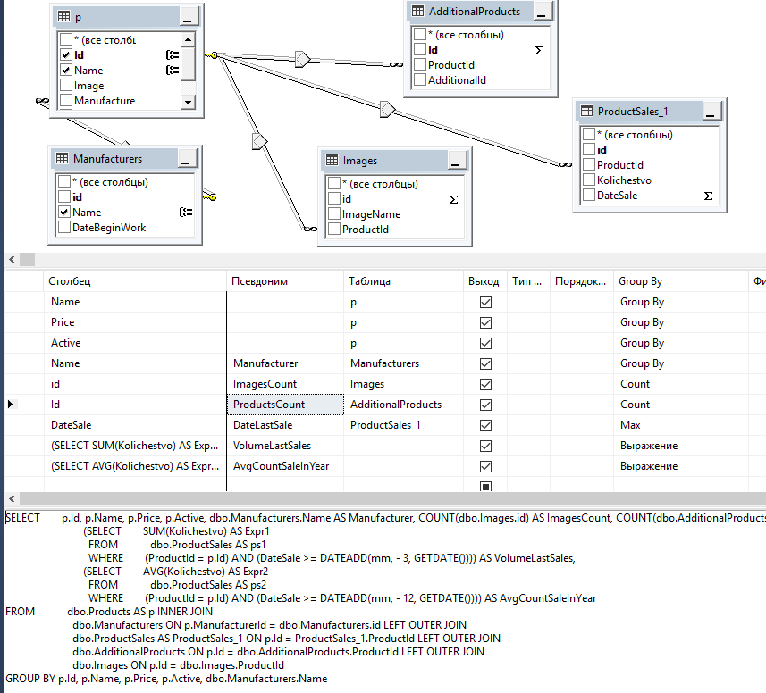

# Сессия 1

* [диаграмма прецедентов (Use Case)](#диаграмма-прецедентов-Use-Case)
* спецификации к UseCase
* UML-диаграммы (диаграмма последовательности)
* проектирование ERD
* словарь данных
* разработка баз данных по ERD
* [импорт данных](#импорт-данных)
* создание объектов базы данных
    * триггер
    * [представление](#представление)


## Диаграмма прецедентов (Use Case)

Теорию я расписал в [лекции](https://github.com/kolei/PiRIS/blob/master/articles/5_1_1_10_uml_use_case.md).


### Практческая реализация

>Для рисования диаграммы я использовал [Visual Paradigm Online](https://online.visual-paradigm.com/diagrams/solutions/free-use-case-diagram-tool/). Вы дома тоже можете тренироваться в ней, чтобы не ставить Visio. 

ВНИМАНИЕ! В критериях оценки снижают баллы за недостающие и ЛИШНИЕ *акторы* и *прецеденты*, поэтому слишком заумствовать не нужно, делайте только то, что описано в предметной области и задании.

**Определяем акторов:**

* есть магазин и просмотр товаров, соответственно должен быть **Клиент**, тот кто в итоге и пользуется услугами магазина
* есть CRUD, соответственно должен быть **Менеджер**, который следит за актуальностью базы данных
* и есть задача "просмотр истории", которая ни к менеджеру ни к клиенту вроде как не относится, но напоминает задачу формирования отчета для любопытного **Руководителя** (это я экстраполирую известные мне критерии оценки, но на самом деле IMHO не очевидный из задания актор)

>В критериях оценки нет конкретики по прецедентам, поэтому не скажу какие именно прецедены нужны для этой задачи, но как минимум по одному для каждого актора (хотя для менеджера их явно больше). 

**Прецедент 1: Покупка автозапчастей**

Из всего, что написано в теории, нужно запомнить только то, что "прецедент" это атомарная функция, которая должна закончится **значимым** результатом. И не путаться в вариантах стрелок: "Include" ведет наружу к другому прецеденту, который является частью родительского, но выделен отдельно, если используется в других прецедентах. "Extend" ведет внутрь и либо вносит дополнительные, но не обязательные, опции, либо, как в нашем случае, приводит к разным вариантам завершения прецедента. 

Для покупки автозапчастей я вижу три варианта: покупка того что есть в наличии, заказ того чего нет и отказ от покупки.


Реализация


>В "классичеком" UseCase не должно быть ветвлений, поэтому я сомневаюсь в первой диаграмме, возможно тут должно быть три отдельных прецедента, плюс расширения от системы и менеджера:
>
>


>В инетах пишут, что границу системы можно не рисовать, т.к. особого смысла она не несет. Обязательно ее нужно рисовать только, если на одном листе несколько подсистем. Но думаю хуже от того что вы ее нарисуете не будет.

## Импорт данных

Рассмотрю на примере файла `product_a_import.csv`

1. Так как файл содержит словарное поле "Производитель", то сначала надо импортировать файл `manufacturer_a_import.txt`, делаете по этой же инструкции, только обратите внимание, что даты там кривые - их надо привести к совместимому виду. К вашему счастью *Managment Studio* умеет это сама:

    

    После импорта также переименовываем таблицу и поля, добавляем первичный ключ:

    

2. Содержимое файла надо нормализовать (привести к единообразному виду). Из того что я увидел:
    * поле "Активен?" заполнено в двух вариантах "да"/"нет" и "активен"/"не активен" - нужно привести к одному варианту (я это делаю в FAR-e, вы можете в Excel-e)
    * поле "цена" содержит хвосты "руб."/"рублей"/"₽" - это все вырезаем
    * не видно сразу, но символ `"\"` в поле "Главное изображение" при импорте воспринимается как служебный и вырезается - меняем его на `"/"`

3. Импортируем в таблицу `product_a_import` 

4. Переименовываем в "products" (или как вы ее назвали в ERD)

5. Создаем первичный ключ

    * название у первичных ключей всегда "id"
    * тип ВСЕГДА целое (кто-то умудрился вставить nvarchar)
    * нужно в "свойствах столбца" настроить "спецификацию идентификатора", чтобы был автоинкремент

    

6. Меняем названия и типы остальных полей в соответствии с ERD. Должно получиться примерно такое:

    

7. При импорте я не видел, чтобы спрашивало про связи - добавляем вручную:

    * создаем поле `manufacturer_id` для связи с таблицей производителей (естественно целое), пока разрешаем NULL

        

    * заполняем связи, пишем SQL-запрос:

        ```sql
        UPDATE dbo.products 
            SET manufacturer_id=manufacturer.id
            FROM manufacturer
            WHERE products.manufacturer=manufacturer.name        
        ```

        т.е. мы устанавливаем поле `manufacturer_id` в соответствии с `id` из таблицы `manufacturer` связывая их по имени производителя (операция эта одноразовая и на больших данных может сильно тормозить, т.к. у производителя нет индекса по названию, но в контексте нашей задачи это не существенно)
    
    * удаляем не нужное больше поле `manufacturer` в таблице `products` и создаем связь между таблицами (это, надеюсь сможете сделать сами)

# Представление

Как мы выяснили на прошлом занятии, для создания представления нужно 5 таблиц (названия полей могут отличатся от предыдущей главы - делал я на другом сервере и уже придерживаясь соглашения *CamelCase*):

>Внимание! За неверные "алиасы" полей в представлении штрафуют, поэтому думайте, когда назваете поля. **Алиас** это альтернативное название поля в SQL-запросе, дело в том, что у нас в нескольких базах есть поле *Name*, и *Management Studio* обзывает их Expr1, Expr2... Вам нужно задать нормальные названия. Ниже я перечисляю таблицы и поля, которые должны попасть в представление. Алиасы буду указывать в скобках

* Products
    * id (в задании на создание представления про id не написано, но мы помним, что фреймворку оно нужно, да и при редактировании/удалении записей оно тоже понадобится)
    * Наименование (**Name**, но этот алиас можно не писать - оно так и буде называться)
    * Стоимость (**Price**)
    * Активность (**Active**)
* Manufacturers
    * Производитель (**Manufacturer**)
* Images    
    * Количество изображений (**ImagesCount**)
* AdditionalProducts
    * Количество товаров (**ProductsCount**)
* ProductSales
    * Дата последней продажи (**DateLastSale**)
    * Объем последних продаж (**VolumeLastSales**)
    * Среднее количество продаж в год (**AverageCountSalesInYear**)



**Products** - основная таблица товаров

**AdditionalProducts** (в прошлый раз мы её назвали **p2p**) - промежуточная таблица для добавления дополнительных товаров к основному 

**ProductSales** - продажи

>В продажах мы должны заменить название товара на его ID:
>
>```sql
>UPDATE dbo.ProductSales
>    SET ProductId=Products.id
>    FROM Products
>    WHERE ProductSales.ProductName=Products.Name
>```

**Images** - дополнительные изображения товара

**Manufacturers** - справочник производителей

## Создание представления

Везде в инете описываются SQL-команды для создания представления, мы попробуем через визуальный нитерфейс:

1. В контекстном меню "Представления" Вашей БД выбираете "создать представление" и добавляете необходимые таблицы

    >Как оказалось, *Management Studio* делает JOIN-ы в порядке добавления таблиц в представление, поэтому добавлять надо по одной, начиная с **Products**

    

2. Добавляем "простые" поля

    

    Добавляя поля из связанных таблиц не забываем задавать "алиас" (производитель => Manufacturer)

    >На скрине ниже название не верное, верное **Manufacturer**

    

3. Добавление "агрегатных" (количество, минимум, среднее...) полей

    Сначала нужно включить группировку для представления - в контекстном меню диаграммы представления выбрать "Добавить Group By"

    

    Поля представления на данный момент должны выглядеть примерно так:

    

    * добавляем количество дополнительных изображений

        Добавляем ЛЮБОЕ поле из таблицы Images (можно даже *, но лучше id) и в колонке "Group By" выбираем агрегатную функцию "Count"

        

        Если сейчас попробовать выбрать данные из представления (предварительно сохранив его), то увидим, что выборка пустая. 

        

        Дело в том, что *Management Studio* при добавлении таблицы в выборку по-умолчанию устанавливает связь **INNER JOIN**, т.е. данные попадают в выборку только если они есть в связанных таблицах, а у нас таблица дополнительных картинок пока пустая. 

        

        Нужно в контекстном меню этой связи (тыкаем прямо по ромбику) "выбрать все строки из Products"

        

        Теперь выборка работает как надо:

        

    * Аналогично добавляем "количество дополнительных товаров" и "Дату последней продажи" (для нее, естественно, выбираем агрегатную функцию **MAX**)

    На этот момент конструктор представления должен выглядеть примерно так (на ProductSale_1 не обращайте внимания, это у меня уже подселекты сделаны и там алиас таблицы поменялся)   

    

4. Добавление "сложных" полей

    Поля "Объем последних продаж" и "Среднее количество продаж в год" агрегатными функциями не посчитать, тут нужно делать вложенные выборки (SELECT). Как это сделать в конструкторе я не нашел, пришлось писать прямо в SQL-запросе, который формируется в нижнем окне

    ```sql
    SELECT p.Id, p.Name, p.Price, p.Active, dbo.Manufacturers.Name AS Manufacturer, COUNT(dbo.Images.id) AS ImagesCount, COUNT(dbo.AdditionalProducts.Id) AS ProductsCount, MAX(ProductSales_1.DateSale) AS DateLastSale,
        -- все что выше, не трогаем, а ниже пишем подселекты для двух полей (не забыв поставить запятую, разделитель полей)
        (SELECT SUM(ps1.Kolichestvo) AS Expr1
            FROM dbo.ProductSales AS ps1
            WHERE (ps1.ProductId = p.Id) AND (ps1.DateSale >= DATEADD(mm, - 3, GETDATE()))) AS VolumeLastSales,

        (SELECT AVG(ps2.Kolichestvo) AS Expr2
            FROM dbo.ProductSales AS ps2
            WHERE (ps2.ProductId = p.Id) AND (ps2.DateSale >= DATEADD(mm, - 12, GETDATE()))) AS AvgCountSaleInYear

        -- ниже тоже не трогаем
    FROM dbo.Products AS p 
    INNER JOIN dbo.Manufacturers ON p.ManufacturerId = dbo.Manufacturers.id 
    LEFT OUTER JOIN dbo.ProductSales AS ProductSales_1 ON p.Id = ProductSales_1.ProductId 
    LEFT OUTER JOIN dbo.AdditionalProducts ON p.Id = dbo.AdditionalProducts.ProductId 
    LEFT OUTER JOIN dbo.Images ON p.Id = dbo.Images.ProductId
    GROUP BY p.Id, p.Name, p.Price, p.Active, dbo.Manufacturers.Name    
    ```

    Рассмотрим подробнее один подселект:

    ```sql
    -- подселекты обязательно должны быть в круглых скобках
    (
        -- тут мы выбираем объем продаж (сумму по полю Kolichestvo)
        -- алиас Expr1 подставила Management Studio, его можно не трогать, итоговое название поля задается после подселекта
        SELECT SUM(ps1.Kolichestvo) AS Expr1
            -- таблице задаем алиас "ps1" - в рамках одного запроса повторно используемые таблицы должны иметь уникальные названия (алиасы)
            FROM dbo.ProductSales AS ps1
            -- выбираем продажи соответствующие текущему товару (да, подселекты срабатывают для каждой строки таблицы)
            -- и указываем фильтр по дате, заданный в ТЗ
            WHERE (ps1.ProductId = p.Id) AND (ps1.DateSale >= DATEADD(mm, - 3, GETDATE()))
    -- после подселекта задаем название полученному полю        
    ) AS VolumeLastSales,
    ```

    Итоговый конструктор выглядит примерно так. Вроде бы можно подселект писать прямо в столбец, но студии чем-то не понравилась функция DATEADD, ругалась на что-то, так что запоминайте куда вписать подселект в основном запросе

    
