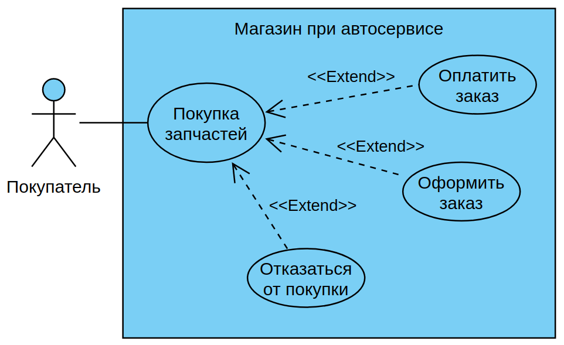
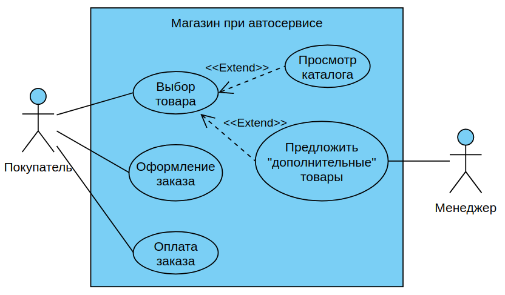
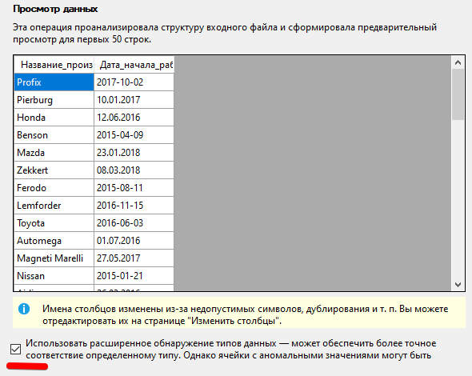
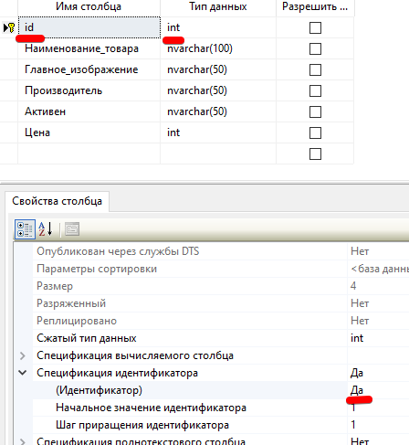
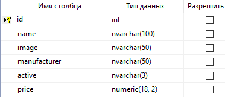
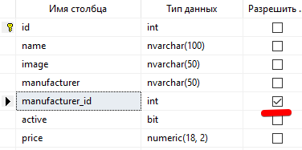

# Сессия 1

* [диаграмма прецедентов (Use Case)](#диаграмма-прецедентов-Use-Case)
* спецификации к UseCase
* UML-диаграммы (диаграмма последовательности)
* проектирование ERD
* словарь данных
* разработка баз данных по ERD
* [импорт данных](#импорт-данных)
* создание объектов базы данных
    * триггер
    * представление


## Диаграмма прецедентов (Use Case)

Теорию я расписал в [лекции](https://github.com/kolei/PiRIS/blob/master/articles/5_1_1_10_uml_use_case.md).


### Практческая реализация

>Для рисования диаграммы я использовал [Visual Paradigm Online](https://online.visual-paradigm.com/diagrams/solutions/free-use-case-diagram-tool/). Вы дома тоже можете тренироваться в ней, чтобы не ставить Visio. 

ВНИМАНИЕ! В критериях оценки снижают баллы за недостающие и ЛИШНИЕ *акторы* и *прецеденты*, поэтому слишком заумствовать не нужно, делайте только то, что описано в предметной области и задании.

**Определяем акторов:**

* есть магазин и просмотр товаров, соответственно должен быть **Клиент**, тот кто в итоге и пользуется услугами магазина
* есть CRUD, соответственно должен быть **Менеджер**, который следит за актуальностью базы данных
* и есть задача "просмотр истории", которая ни к менеджеру ни к клиенту вроде как не относится, но напоминает задачу формирования отчета для любопытного **Руководителя** (это я экстраполирую известные мне критерии оценки, но на самом деле IMHO не очевидный из задания актор)

>В критериях оценки нет конкретики по прецедентам, поэтому не скажу какие именно прецедены нужны для этой задачи, но как минимум по одному для каждого актора (хотя для менеджера их явно больше). 

**Прецедент 1: Покупка автозапчастей**

Из всего, что написано в теории, нужно запомнить только то, что "прецедент" это атомарная функция, которая должна закончится **значимым** результатом. И не путаться в вариантах стрелок: "Include" ведет наружу к другому прецеденту, который является частью родительского, но выделен отдельно, если используется в других прецедентах. "Extend" ведет внутрь и либо вносит дополнительные, но не обязательные, опции, либо, как в нашем случае, приводит к разным вариантам завершения прецедента. 

Для покупки автозапчастей я вижу три варианта: покупка того что есть в наличии, заказ того чего нет и отказ от покупки.


Реализация



>В "классичеком" UseCase не должно быть ветвлений, поэтому я сомневаюсь в первой диаграмме, возможно тут должно быть три отдельных прецедента, плюс расширения от системы и менеджера:
>
>


>В инетах пишут, что границу системы можно не рисовать, т.к. особого смысла она не несет. Обязательно ее нужно рисовать только, если на одном листе несколько подсистем. Но думаю хуже от того что вы ее нарисуете не будет.

## Импорт данных

Рассмотрю на примере файла `product_a_import.csv`

1. Так как файл содержит словарное поле "Производитель", то сначала надо импортировать файл `manufacturer_a_import.txt`, делаете по этой же инструкции, только обратите внимание, что даты там кривые - их надо привести к совместимому виду. К вашему счастью *Managment Studio* умеет это сама:

    

    После импорта также переименовываем таблицу и поля, добавляем первичный ключ:

    

2. Содержимое файла надо нормализовать (привести к единообразному виду). Из того что я увидел:
    * поле "Активен?" заполнено в двух вариантах "да"/"нет" и "активен"/"не активен" - нужно привести к одному варианту (я это делаю в FAR-e, вы можете в Excel-e)
    * поле "цена" содержит хвосты "руб."/"рублей"/"₽" - это все вырезаем
    * не видно сразу, но символ `"\"` в поле "Главное изображение" при импорте воспринимается как служебный и вырезается - меняем его на `"/"`

3. Импортируем в таблицу `product_a_import` 

4. Переименовываем в "products" (или как вы ее назвали в ERD)

5. Создаем первичный ключ

    * название у первичных ключей всегда "id"
    * тип ВСЕГДА целое (кто-то умудрился вставить nvarchar)
    * нужно в "свойствах столбца" настроить "спецификацию идентификатора", чтобы был автоинкремент

    

6. Меняем названия и типы остальных полей в соответствии с ERD. Должно получиться примерно такое:

    

7. При импорте я не видел, чтобы спрашивало про связи - добавляем вручную:

    * создаем поле `manufacturer_id` для связи с таблицей производителей (естественно целое), пока разрешаем NULL

        

    * заполняем связи, пишем SQL-запрос:

        ```sql
        UPDATE dbo.products 
            SET manufacturer_id=manufacturer.id
            FROM manufacturer
            WHERE products.manufacturer=manufacturer.name        
        ```

        т.е. мы устанавливаем поле `manufacturer_id` в соответствии с `id` из таблицы `manufacturer` связывая их по имени производителя (операция эта одноразовая и на больших данных может сильно тормозить, т.к. у производителя нет индекса по названию, но в контексте нашей задачи это не существенно)
    
    * удаляем не нужное больше поле `manufacturer` в таблице `products` и создаем связь между таблицами (это, надеюсь сможете сделать сами)