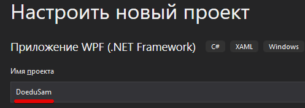
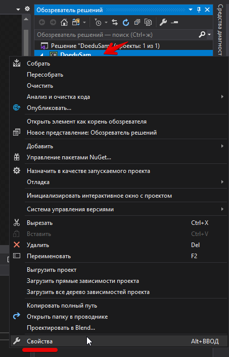
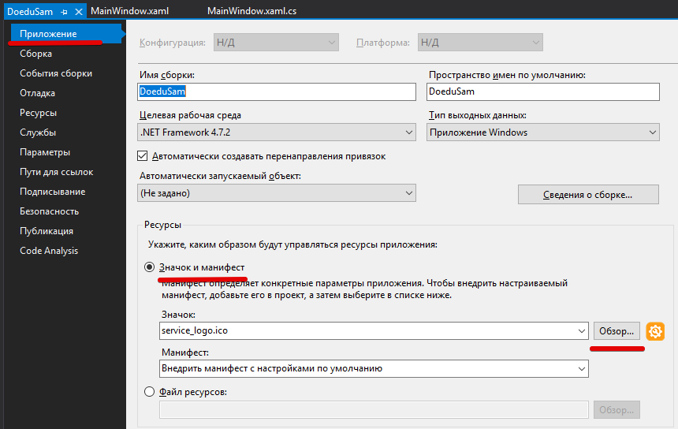
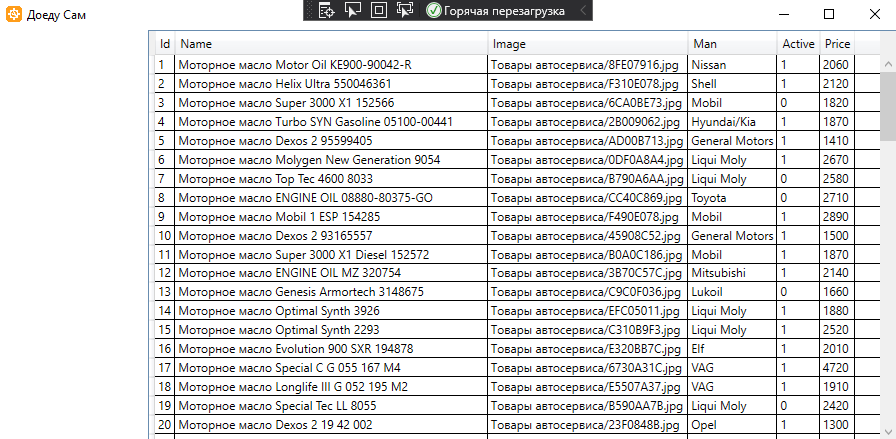

# Рекомендации по реализации Сессии 2

## Название приложения

В "Требованиях и рекомендациях" сказано, что наименование приложения должно ОБЯЗАТЕЛЬНО включать название компании заказчика, поэтому никаких Demo, doom не должно быть:



>Называть лучше латиницей, хз как поведет себя система с кириллицей в названии

## Установка иконки

В контекстном меню **приложения** выбираете *свойства*



В первом же пункте "приложение" через "обзор" находите иконку (она есть в "общих ресурсах"). Студия автоматически скопирует файл иконки в корень проекта, руками его копировать не нужно.



## Цветовая схема и логотип

Это было в лекциях и многие это даже сделали, останавливаться не буду.

## Заголовки окон

Для главного окна можно написать название компании (*.xaml - Window - Title), для остальных по назначению окна. Например, если открываете окно со справочником товаров, то так и называейте "Справочник товаров"

```xml
<Window
    ...
    Title="Доеду Сам">
```

## Ограничение размера окна

Про это я тоже говорил, но многие не сделали... Добавляете к тегу **Window** атрибуты *MinHeight* и *MinWidth*. Размеры эти нужно подбирать по содержимому, чтобы не терялись кнопки и другие визуальные компоненты.

```xml
<Window
    MinHeight="400" MinWidth="700"
    Title="Доеду Сам" Height="450" Width="800">
```

## Список товаров

Из МРМТ **никто** не сделал интерфейс "плиткой", так что и вы не впадайте в ступор, а тупо рисуйте **DataGrid**, мы его проходили.

*"Каждый товар должен содержать следующую информацию: главное изображение, наименование, стоимость и отметку об активности"* - т.е. в DataGrid-e отображаете только эти поля таблицы товаров.

*Если товар не активен, то фон элемента должен быть серого цвета*

Можно также не рисовать навигатор со страницами, а сразу в главном окне вывести таблицу товаров (это, правда, будет нарушением логики, т.к. каждая сущность должна быть в своем файле)

Ниже как раз приведен до предела упрощенный код такого приложения который, тем не менее, рисует таблицу в нужном месте:

```xml
<Grid>
    <Grid.ColumnDefinitions>
        <ColumnDefinition Width="150"/>
        <ColumnDefinition Width="1*"/>
    </Grid.ColumnDefinitions>

    <DataGrid Grid.Column="1" ItemsSource="{Binding MyProducts}"/>
</Grid>
```

```cs
public partial class MainWindow : Window
{
    private List<Products> _MyProducts;
    public List<Products> MyProducts
    {
        get
        {
            return _MyProducts;
        }
        set
        {
            _MyProducts = value;
        }
    }

    public MainWindow()
    {
        InitializeComponent();
        this.DataContext = this;
        MyProducts = Core.DB.Products.ToList();
    }
}
```



Это была программа минимум для тех, кому достаточно тройки и кто надеется набрать баллов в других сессиях.

## Продвинутый вариант

Читаем ТЗ и записываем требования:

* товар должен содержать следующую информацию
    * ~~главное изображение~~ (пока пропустим)
    * наименование (с количеством дополнительных товаров)
    * стоимость
    * отметку об активности
* поиск по названию в реальном времени
* фильтр по производителю в реальном времени
* ~~сортировка по полям~~ (это DataGrid делает сам)
* в нижней части окна нужно показывать сколько выведено и сколько всего товаров

>Показ количества дополнительных товаров требует выборки с группировкой, делать это в приложении моветон, это нужно делать в *представлении* (пока пропустим)

[Хабр. Отношения.](https://habr.com/ru/post/488054/)

https://code.tutsplus.com/ru/articles/sql-for-beginners-part-3-database-relationships--net-8561


Настраиваем отображаемые колонки. Нового для вас тут ничего нет, это было в лекциях - нужно тупо запомнить. Единственно, что у меня в таблице поле *Active* типа **int**, поэтому я его значение вычисляю геттером:

```xml
<DataGrid 
    Grid.Column="1" 
    ItemsSource="{Binding MyProducts}"
    AutoGenerateColumns="False">

    <!-- а это раскраска строк в зависимости от активности товара -->
    <DataGrid.RowStyle>
        <Style TargetType="DataGridRow">
            <Style.Triggers>
                <DataTrigger Binding="{Binding Active}" Value="0">
                    <Setter Property="Background" Value="LightGray"/>
                </DataTrigger>
            </Style.Triggers>
        </Style>
    </DataGrid.RowStyle>

    <DataGrid.Columns>
        <DataGridTextColumn 
            Header="Название"
            Binding="{Binding Name}"/>
        <DataGridTextColumn 
            Header="Цена" 
            Binding="{Binding Price}"/>
        <DataGridTextColumn 
            Header="Активен" 
            Binding="{Binding ActiveStr}"/>
    </DataGrid.Columns>
</DataGrid>
```

```cs
public partial class Products
{
    ...
    public int Active { get; set; }
    public string ActiveStr { 
        get {
            if (Active == 1) return "да";
            else return "нет";
        } 
    }
}
```

