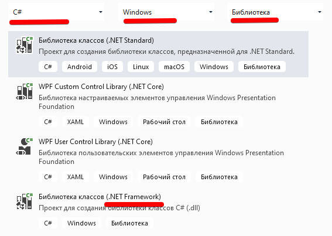
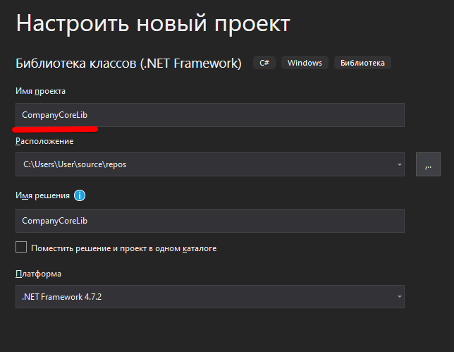
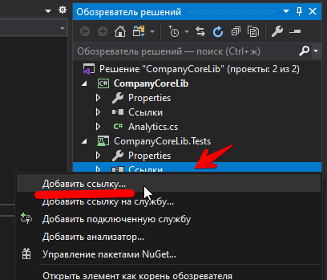
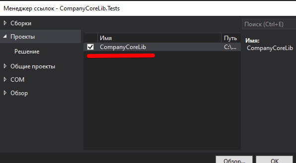
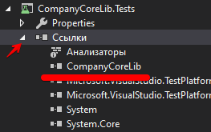

# Сессия 3

* Разработка библиотеки классов
* Разработка модульных тестов
* Разработка тестовых сценариев

## Разработка библиотеки классов

Я входе предварительной подготовки показывал как делать тесты для проекта, они в принципе одинаковые для любого типа проектов. Но все (и МРМТ тоже) впали в ступор от слов "библиотека классов". Заполним этот пробел.

Библиотека это отдельный проект. Для C# этот проект должен генерировать файл `*.dll`

### Замечания по репозиторию

На демо экзамене ни главный админ, ни я не читали задание (мне вообще нельзя было это делать), поэтому ввели всех в заблуждение, что нужно все пихать в один репозиторий. Но в задании явно сказано "*В качестве названия для библиотеки необходимо использовать: `CompanyCoreLib`. Вам необходимо загрузить исходный код проекта с библиотекой в **отдельный** репозиторий с названием, совпадающим с названием приложения.*" То есть надо было поднять руку и сказать, что Вы, товарищ главный админ не правы. На будущее - пишете какие хотите репозитории в свой аккаунт на локальном ГИТ-е, но имейте в виду, что эксперты не будут разбираться в вашей иерархии, сказано, что репозиторий должен называться `CompanyCoreLib`, значит его и откроют, а искать по другимм репозиториям не будут.

>Однако в "Требованиях и рекомендациях" указано, что каждая сессия должна быть загружена в отдельную **ветку** с названием "Сессия Х"... Но к этому вроде не придирались (посмотрю еще в критериях оценки).

Т.е. у вас в итоге должно получиться 3 репозитория:

* session1 (с диаграммами, не помню чтобы там были требования к названию репозитория, если вдруг увидите, то называйте как положено)
* my_cool_program (пока не смотрел как надо именовать приложение во второй сессии, но скорее всего созвучно названию компании)
* CompanyCoreLib (третья сессия - тут явно указано какое имя должно быть у репозитория)

### Создание проекта

Создаем **новый** проект, установив нужные фильтры (C#, Windows, Библиотека) и выбрав проект для соответствующей платформы. Мы всё делаем для **.NET Framework**.



Не забываем указать название проекта. Как вы тут напишете, так dll и будет называться.



В итоге студия создаст нам "рыбу" с одним файлом:

```cs
using System;
using System.Collections.Generic;
using System.Linq;
using System.Text;
using System.Threading.Tasks;

namespace CompanyCoreLib
{
    public class Class1
    {
    }
}
```

### Создание класса аналитики

Можно, конечно, прямо в этом файле переименовать класс, но это нарушение логической структуры проекта (файл то будет называться по-старому). Поэтому создаем новый класс (1), а рыбу удаляем (2).

1. *Контекстное меню проекта -> Добавить -> Создать элемент*. Далее в списке находим "Класс" и не забываем задать ему название (Analytics в нашем случае). Получится аналогичная "рыба" с нужным названием класса:

    ```cs
    using System;
    using System.Collections.Generic;
    using System.Linq;
    using System.Text;
    using System.Threading.Tasks;

    namespace CompanyCoreLib
    {
        class Analytics
        {
        }
    }
    ```
2. *Контекстное меню Class1 -> Удалить*

### Реализация класса аналитики

В *спецификации метода* (был и такой файл в материалах сессии 3) указано название метода и его параметры, добавляем в наш класс:

```cs
public class Analytics
{
    public List<DateTime> PopularMonths(List<DateTime> dates) {
        return list;
    }
}
```

**Во-первых**, обращаем внимание на ключевое слово "public" перед названием КЛАССА. Студия его автоматом не пишет, а для экспорта оно нужно. На эти грабли мы уже наступали при тестировании, напоминаю еще раз.

**Во-вторых**, на этом этапе не надо ничего придумывать - и типы данных, и название метода, и даже название параметра метода явно указаны с спецификации.

Собственно уже эта реализация дает почти целый балл в оценке (хотя она ничего и не делает, просто возвращает то что пришло обратно)

>Нормальную реализацию этого метода я попробую расписать позже, если хватит времени, пока займемся тестированием

## Разработка модульных тестов

Собственно это мы уже проходили, но повторим на этом примере еще раз.

### Создание проекта для модульных тестов

В контекстном меню **РЕШЕНИЯ** выбираете *Добавить -> Создать проект*

При создании проекта можете воспользоваться фильтрами "языки", "платформа" и "типы проектов". В итоге надо выбрать "Проект модульного теста (.NET Framework)"


Правила формирования имени тестового проекта были в лекции, у меня получилось **CompanyCoreLib.Tests**. Расположение не трогаем, по-умолчанию тестовый проект сохранится в том же решении (рядом с основным проектом)

### Связь с основным проектом

Дальше нужно добавить связь с основным проектом:

В тестовом проекте находим пункт "ссылки" (раньше назывался "зависимости") и в контекстном меню "добавить ссылку"



Выбрать основной проект (их может быть несколько), у нас он называется **CompanyCoreLib**.



Проверить, добавлен ли проект в зависимости, можно раскрыв "ссылки"



### Написание тестов

Тут смотрите лекцию по тестированию, ничего нового не скажу

## Разработка тестовых сценариев

Пока остановился тут