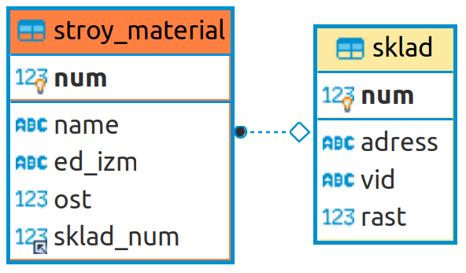
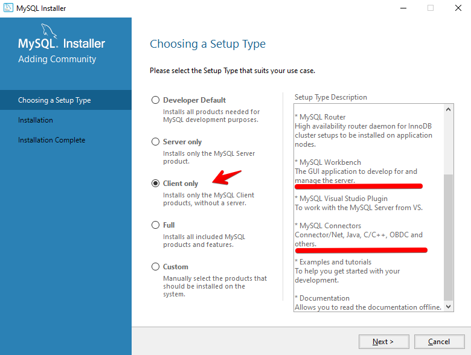
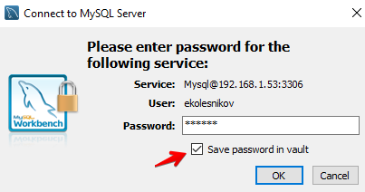
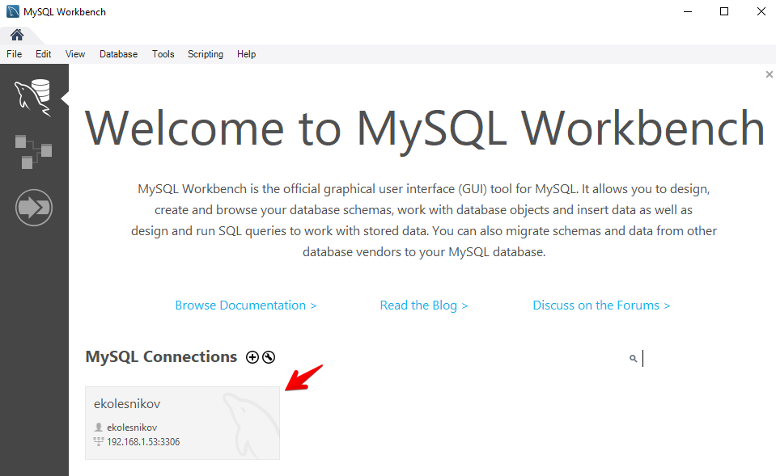
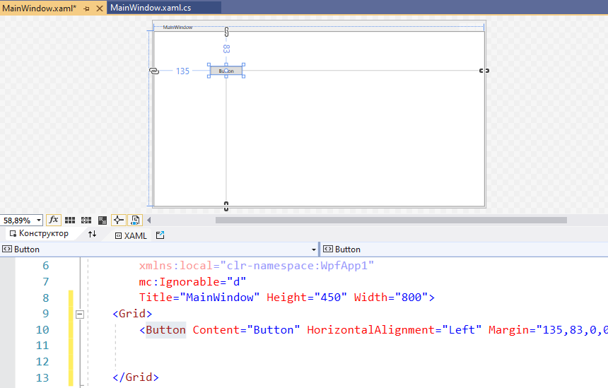

[задание взято отсюда]: https://docplayer.ru/49945157-Zadaniya-demonstracionnogo-ekzamena-kompetenciya-programmirovanie-v-kompyuternyh-sistemah-specialnost-programmirovanie-v-kompyuternyh-sistemah.html

[C# + DB]: https://it-black.ru/rabota-s-bazoj-dannyh-v-ci_sharp/

>[Скринкаст: Подготовка к демо-экзамену по компетенции "Программные решения для бизнеса"](https://lawreps-my.sharepoint.com/:f:/g/personal/zy691_nig3_a1p_me/EtAw5Adn5-JEsCa_16SIRSABDyllhE5-pOsH94pMDtcLrQ?e=5VtQq7)
>
>
>

# Подготовка к демо-экзамену по компетенции "Программные решения для бизнеса"

[like, count, lenght, between, timediff]: //TODO

[хранимые процедуры]: _

Используемые технологии: MySQL, C#

>экзаменов у нас еще не было, далее идет примерная компиляция по тому что нашел в интернете

Модули задания (не все из них у нас будут)

* [Проектирование структуры данных](#Проектирование-структуры-данных)
* [Составление запросов](#Составление-запросов)
* [Импорт данных](#Импорт-данных)
* [MySQL Installer](#MySQL-Installer)
* [Программирование](#Программирование)
* ~~Реализация отчетов~~
* ~~Проектирование архитектуры~~
* Тестирование
* ~~Разработка мобильного приложения~~
* Документация
* ~~Общий профессионализм решения~~

## Проектирование структуры данных

У строительной организации несколько складов. 

Создайте базу данных, учитывая что:
* В базе данных должны содержаться сведения о:
    - складах  (данными  о  складе  являются  его  номер,  адрес,  вид хранящихся   строительных материалов, расстояние до областного центра);
    - строительных  материалах  (данными  о  материалах  являются  его номер, наименование, единица измерения, остаток, склад).
* Первая таблица связана со второй связью «один ко многим»; 
* Значения первого поля в каждой таблице должно быть уникальными и не содержать значений NULL; 
* Первые поля в таблицах являются первичными ключами; 
* Последнее поле во второй таблице является внешним ключом.

### Таблица Склад

№ склада | Адрес | Вид материалов | Расстояние
:-------:|-------|----------------|:---:
1 | д.Крутово | сыпучие | 5
2 | пос.Веканово | отделочные | 10
3 | пос.Заскочиха | отделочные | 15
4 | д.Орлово | отделочные | 8
5 | д.Комарово | кирпич | 12

### Таблица Стройматериал

№ материала | Наименование | Ед_изм | Остаток | Склад
:----------:|--------------|:------:|:-------:|:---:
5466 | Цемент | кг | 680 | 1
7898 | Краска | кг | 350 | 4
1232 | Шпатлевка | кг | 260 | 2
4565 | Кирпич глиняный | м3 | 68 | 5
7535 | Песок | т | 250 | 1
1595 | Известь | т | 9 | 3
8542 | Кирпич силикатный | м3 | 120 | 5

>Виды материалов и единицы измерения являются справочниками и по идее должны быть вынесены в отдельные таблицы.

Для создания таблиц в MySQL используется команда CREATE TEBLE. Рассмотрим ее синтаксис и напишем запросы для создания наших таблиц:

>Квадратными скобками отмечаются не обязательные параметры

```sql
CREATE TABLE [IF NOT EXISTS] [db_name.]tbl_name [(create_definition,...)] [table_options];
```

, где:
* *CREATE TABLE* - команда "создать таблицу"
* *IF NOT EXISTS* - создавать только, если таблица не существует (если таблица существует и повторно попытаться выполнить команду CREATE TABLE, то драйвер БД вернет ошибку и в программе будет вызвано исключение, что может поломать логику работы тем, кто забыл про обработку исключений).
* *[db_name.]* - название базы данных в которой создается таблица;
* *tbl_name* - название создаваемой таблицы. Название должно быть из латинских букв без пробелов.
    >В примерах часто названия таблиц и полей пишут русскими буквами, но у нас не 1С, поэтому все делаем латиницей трансилитом

    в нашем случае первую таблицу назовем **sklad**, а вторую **stroy_material**
* *(create_definition,...)* - список создаваемых полей,индексов и т.п.; 
* *table_options* - параметры таблицы (тип, комментарий и т.д.). Мы в эти дебри пока не лезем;

Рассмотрим подробнее параметр *create_definition* (он имеет несколько вариантов):

1. Создание поля:

    ```
    col_name type [NOT NULL | NULL] [DEFAULT default_value] [AUTO_INCREMENT] [PRIMARY KEY] [COMMENT '']
    ```            

    , где:

    * *col_name* - название поля;
    * *type* - тип поля. Вообще типов полей достаточно много, но мы рассмотрим только основные:
        - *TINYINT[(размер)]* - буквально "крошечное целое". Обычно используется для логических полей: TINYINT(1);
        - *INT[(размер)]* - обычное целое, размер по умолчанию = 11;
        - *DECIMAL(размер, количество знаков после запятой)* - вещественные числа (с запятой);
        - *VARCHAR(размер)* - строка;
        - *TEXT* - текст произвольной длины.
    * *NOT NULL | NULL* - может ли быть поле не заполненным. В нашем задании явно сказано что поля "№ склада" и "№ материала" не могут быть пустыми. Если для поля указан параметр "NOT NULL", то при попытке вставить запись без этого поля возникнет ошибка. Если не указывается ни NULL, ни NOT NULL, то столбец интерпретируется так, как будто указано NULL;
    * *DEFAULT default_value* - значение по-умолянию. Например поле  остаток не должно быть пустым и при создании таблицы можно указать ему "DEFAULT 0"
    * *[AUTO_INCREMENT]* - Целочисленный столбец может иметь дополнительный атрибут AUTO_INCREMENT. При записи величины NULL (рекомендуется) или 0 в столбец AUTO_INCREMENT данный столбец устанавливается в значение value+1, где value представляет собой наибольшее для этого столбца значение в таблице на момент записи;
    * *[PRIMARY KEY]* - PRIMARY KEY представляет собой уникальный ключ KEY (индекс) с дополнительным ограничением, что все столбцы с данным ключом должны быть определены как NOT NULL. Таблица может иметь только один первичный ключ PRIMARY KEY. Хотя этот парамтер и не обязательный, но первичный ключ требуется во многих фреймворках и считается хорошей практикой первым полем в базе сделать ``id INT AUTO_INCREMENT PRIMARY KEY``
    * *[COMMENT 'текст комментария']*

2. Создание внешних ключей

    Внешние ключи позволяют установить связи между таблицами. Внешний ключ устанавливается для столбцов из зависимой, подчиненной таблицы, и указывает на один из столбцов из главной таблицы. Как правило, внешний ключ указывает на первичный ключ из связанной главной таблицы.

    Тут надо понимать, что KEY это синоним INDEX, т.е. FOREIGN KEY не просто ограничение поля (в такое поле нельзя записать значение, которого нет в связанном поле основной таблицы и, по-умолчанию, нельзя удалять записи основной таблицы, если у них есть связи в зависимой таблице), но и индексированный поиск в дочерней таблице по связанным полям.

    ```
    [CONSTRAINT имя_ограничения] FOREIGN KEY (столбец1, столбец2, ... столбецN) REFERENCES главная_таблица (столбец_главной_таблицы1, столбец_главной_таблицы2, ... столбец_главной_таблицыN)
    ```

    , где:
    * *[CONSTRAINT имя_ограничения]* - задает имя ограничения, обычно в виде "текущая таблица"_"главная таблица"_fk;
    * *FOREIGN KEY (столбец1, столбец2, ... столбецN)* - внешний ключ: поле (или поля), которые служат для связи с главной таблицей;
    * *REFERENCES главная_таблица (столбец_главной_таблицы1, столбец_главной_таблицы2, ... столбец_главной_таблицыN)* - ссылка на поля главной таблицы;

Теперь, зная синтаксис, напишем команды для создания наших таблиц:

```sql
-- два минуса - это комментарий в SQL-запросах

CREATE TABLE IF NOT EXISTS user1.sklad (
    -- в задании явно сказано, что номер склада должен быть уникальным, для этого идеально подходит PRIMARY KEY
    num INT NOT NULL PRIMARY KEY COMMENT 'номер склада',
    adress VARCHAR(255),
    vid VARCHAR(32) COMMENT 'вид материалов',
    rast INT COMMENT 'расстояние до областного центра'
);

CREATE TABLE IF NOT EXISTS user1.stroy_material (
    num INT NOT NULL PRIMARY KEY COMMENT 'номер материала',
    name VARCHAR(255) COMMENT 'название',
    ed_izm VARCHAR(16) COMMENT 'единицы измерения',
    ost INT NOT NULL DEFAULT 0  COMMENT 'остаток',
    -- при ссылке на другую таблицу поле обычно называют "таблица"_"поле для связи"
    sklad_num INT NOT NULL,
    CONSTRAINT material_sklad_fk FOREIGN KEY (sklad_num) REFERENCES sklad (num) 
);
```



## Составление запросов

Составьте запросы к базе данных (использование языка запросов SQL оценивается дополнительными баллами):

>Существует несколько видов запросов:  
**INSERT** - добавление записей;  
**UPDATE** - изменение;  
**DELETE** - удаление;  
**SELECT** - выборка;  

### INSERT

Упрощенная схема запроса:

```
INSERT [INTO] название_таблицы [(название_поля,...)]
    VALUES (выражение,...),(...),...
```

,где:
* *[(название_поля,...)]* - список полей таблицы, которые мы заполняем. Если заполняются все поля, то этот параметр можно пропустить.
* *VALUES (выражение,...),(...),...* - несколько наборов значений для вставки в таблицу. Порядок значений должен быть тот же что и в списке *названий полей* (или тот, в котором поля определены в таблице, если список названий полей не используется)

Примеры:

```sql
-- обратите внимание: строковые значения передаются в кавычках
INSERT INTO sklad (num, adress, vid, rast)
    VALUES  (1,"д.Крутово","сыпучие",5),(2,"пос.Веканово","отделочные",10),
            (3,"пос.Заскочиха","отделочные",15),(4,"д.Орлово","отделочные",8),
            (5,"д.Комарово","кирпич",12);

-- в этом примере мы заполняем все поля, поэтому список полей пропущен
INSERT INTO stroy_material
    VALUES  (5466,"Цемент","кг",680,1),(7898,"Краска","кг",350,4),
            (1232,"Шпатлевка","кг",260,2),(4565,"Кирпич глиняный","м3",68,5);

-- а в этом примере в списке полей пропущен "остаток"
INSERT INTO stroy_material (num, name, ed_izm, sklad_num)
    VALUES  (7535,"Песок","т",1),(1595,"Известь","т",3),
            (8542,"Кирпич силикатный","м3",5);
```

### SELECT

Выборка данных из таблицы (или нескольких таблиц).

Упрощенная схема запроса:

```
SELECT [DISTINCT | DISTINCTROW | ALL]
    select_expression,...
    FROM название_таблицы
        [WHERE условие]
        [GROUP BY {unsigned_integer | col_name | formula} [ASC | DESC], ...]
        [HAVING условие]
        [ORDER BY {unsigned_integer | col_name | formula} [ASC | DESC], ...]
        [LIMIT [offset,] rows]
```

Рассмотрим на примерах:

* Напишите запрос, который выводит Адрес, Вид_материалов и Расстояние из таблицы Склад.

    ```sql
    SELECT adress,vid,rast FROM sklad;
    ```

* Напишите  запрос,  который  вывел  бы  список  всех  стройматериалов, находящихся на складе в д.Комарово.

    Тут возможны два варианта, когда мы знаем номер склада:

    ```sql
    SELECT name 
	    FROM stroy_material
	    WHERE sklad_num = 5;
    ```

    и поиск по названию склада:

    ```sql
    SELECT sm.name 
	    FROM sklad s, stroy_material sm
	    WHERE s.adress = 'д.Комарово' AND sm.sklad_num = s.num ;
    ```

    - если выборка идет из нескольких таблиц, то можно после названия таблицы указать алиас и перед полями указывать алиас, а не полное название таблицы

    - условие выборки состоит из двух логических выражений объединенных логическим "И"

* Напишите запрос, который вывел бы таблицу Стройматериал со столбцами в обратном порядке.

    В условиях задачи не сказано по какому полю сортировать, считаем что по первичному ключу. Для задания сортировки используется команда *ORDER BY название_поля ASC | DESC*. Где ASC - сортировка по возрастанию (используется по-умолчанию), DESC - по убыванию:

    ```sql
    SELECT * 
        FROM stroy_material 
        ORDER BY num DESC;
    ```

* Напишите запрос, извлекающий из таблицы Стройматериал список складов, где хранятся эти стройматериалы. Склады не должны повторяться.

    Для выборки уникальных полей служит клчевое слово DISTINCT. 
    
    Условие WHERE позволяет выбирает только те склады, в которых есть материалы

    ```sql
    SELECT DISTINCT s.num, s.adress 
	    FROM stroy_material sm, sklad s 
	    WHERE s.num = sm.sklad_num;
    ```

    Можно усложнить запрос и в условие добавить проверку остатка, чтобы не ехать на склад за материалом, которого не осталось (хотя запись в таблице осталась):

    ```sql
    SELECT DISTINCT s.num, s.adress 
	    FROM stroy_material sm, sklad s 
	    WHERE sm.ost > 0 AND s.num = sm.sklad_num;
    ```

* Напишите запрос, выводящий наименование и номер склада стройматериала с самым большим остатком.

    >Задача не совсем корректная, единицы измерения у материалов разные

    >Поиск по неиндексированному полю (остаток) может занять много времени. Если такие запросы действительно нужны, то нужно создать индекс по этому полю

    Вариант с сортировкой по убыванию и лимитом:

    ```sql
    SELECT s.num, s.adress
	    FROM stroy_material sm, sklad s 
	    WHERE s.num = sm.sklad_num
	    ORDER BY sm.ost DESC 
	    LIMIT 1
    ```
* Напишите  запрос  на  создание  списка, состоящего  из  Наименования стройматериала  и  Адреса  склада,  где  он хранится  для  всех  складов, расположенных на расстоянии не менее 12 км от областного центра.

    ```sql
    SELECT sm.name, s.adress 
        FROM stroy_material sm, sklad s
        WHERE sm.sklad_num=s.num AND s.rast<12;
    ```

### UPDATE

Изменение данных.

```
UPDATE название_таблицы
    SET название_поля1=выражение1 [, название_поля2=выражение2, ...]
    [WHERE условие]
```

* Напишите  запрос, который  уменьшает остаток  всех  строительных материалов на 10%.

    ```sql
    UPDATE stroy_material 
	    SET ost = ost - ost*0.1
	    WHERE ost>0
    ```

* Напишите  запрос, переводящий  строительные  материалы,  находящиеся  на складе в пос. Веканово на склад в пос. Заскочиха.

    Вариант, когда нам известны номера складов (Веканово = 2, Заскочиха = 3):

    ```sql
    UPDATE stroy_material 
	    SET sklad_num = 3
	    WHERE sklad_num = 2;
    ```

    И вариант, когда номер не известен:

    ```sql
    UPDATE stroy_material sm, sklad s 
 	    SET sm.sklad_num = (SELECT num FROM sklad WHERE adress="пос.Веканово")
 	    WHERE s.adress = "пос.Заскочиха" and s.num = sm.sklad_num 
    ```

    Обратите внимание: 

    - после ключевого слова **UPDATE** мы перечисляем все таблицы, которые учавствуют в запросе (как **FROM** у **SELECT**);
    - в качестве выражения используем вложенный **SELECT**.

### DELETE

Удаление записей

```sql
DELETE FROM название_таблицы
    [WHERE условие]
```

* Напишите запрос на удаление всех стройматериалов, хранящихся на складе №1.

    ```sql
    DELETE 
        FROM stroy_material 
        WHERE sklad_num = 1;
    ```

Для закрепления материала пройдитесь по урокам в [онлайн тренажере](https://sql-academy.org/ru/trainer?sort=byIncreasingDifficulty). Там же можно почитать Учебник.

## Импорт данных

Стандартом *де-факто* для импорта/экспорта данных является формат CSV.

### Что такое CSV-файлы

Формат CSV используют, чтобы хранить таблицы в текстовых файлах. Данные очень часто упаковывают именно в таблицы, поэтому CSV-файлы очень популярны.

CSV расшифровывается как comma-separated values — «значения, разделенные запятыми». Но разделителями столбцов в CSV-файле могут служить и точки с запятой, и знаки табуляции. Это все равно будет CSV-файл.

У CSV куча плюсов перед тем же форматом Excel: текстовые файлы просты как пуговица, открываются быстро, читаются на любом устройстве и в любой среде без дополнительных инструментов.

Из-за своих преимуществ CSV — сверхпопулярный формат обмена данными, хотя ему уже лет 40. CSV используют прикладные промышленные программы, в него выгружают данные из баз.

Одна беда — текстового редактора для работы с CSV мало. Еще ничего, если таблица простая: в первом поле ID одной длины, во втором дата одного формата, а в третьем какой-нибудь адрес. Но когда поля разной длины и их больше трех, начинаются мучения.

Еще хуже с анализом данных — попробуй «Блокнотом» хотя бы сложить все числа в столбце. Я уж не говорю о красивых графиках.

Поэтому CSV-файлы анализируют и редактируют в Excel и аналогах: Open Office, LibreOffice и прочих.

### Как Excel портит данные: из классики

Все бы ничего, но Excel, едва открыв CSV-файл, начинает свои лукавые выкрутасы. Он без спроса меняет данные так, что те приходят в негодность. Причем делает это совершенно незаметно. Из-за этого в свое время мы схватили ворох проблем.

Большинство казусов связано с тем, что программа без спроса преобразует строки с набором цифр в числа.

**Округляет**. Например, в исходной ячейке два телефона хранятся через запятую без пробелов: «5235834,5235835». Что сделает Excel? Лихо превратит номера́ в одно число и округлит до двух цифр после запятой: «5235834,52». Так мы потеряем второй телефон.

**Приводит к экспоненциальной форме**. Excel заботливо преобразует «123456789012345» в число «1,2E+15». Исходное значение потеряем напрочь.

Проблема актуальна для длинных, символов по пятнадцать, цифровых строк. Например, КЛАДР-кодов (это такой государственный идентификатор адресного объекта: го́рода, у́лицы, до́ма).

**Удаляет лидирующие плюсы**. Excel считает, что плюс в начале строки с цифрами — совершенно лишний символ. Мол, и так ясно, что число положительное, коль перед ним не стоит минус. Поэтому лидирующий плюс в номере «+74955235834» будет отброшен за ненадобностью — получится «74955235834». (В реальности номер пострадает еще сильнее, но для наглядности обойдусь плюсом).

Потеря плюса критична, например, если данные пойдут в стороннюю систему, а та при импорте жестко проверяет формат.

**Разбивает по три цифры**. Цифровую строку длиннее трех символов Excel, добрая душа, аккуратно разберет. Например, «8 495 5235834» превратит в «84 955 235 834».

Форматирование важно как минимум для телефонных номеров: пробелы отделяют коды страны и города от остального номера и друг от друга. Excel запросто нарушает правильное членение телефона.

**Удаляет лидирующие нули**. Строку «00523446» Excel превратит в «523446».
А в ИНН, например, первые две цифры — это код региона. Для Республики Алтай он начинается с нуля — «04». Без нуля смысл номера исказится, а проверку формата ИНН вообще не пройдет.

**Меняет даты под локальные настройки**. Excel с удовольствием исправит номер дома «1/2» на «01.фев». Потому что Windows подсказал, что в таком виде вам удобнее считывать даты.

### Побеждаем порчу данных правильным импортом

Если серьезно, в бедах виноват не Excel целиком, а неочевидный способ импорта данных в программу.

По умолчанию Excel применяет к данным в загруженном CSV-файле тип «General» — общий. Из-за него программа распознает цифровые строки как числа. Такой порядок можно победить, используя встроенный инструмент импорта.

**Запускаем** встроенный в Excel механизм импорта.

**Выбирем** CSV-файл с данными, открывается диалог. В диалоге кликем на тип файла Delimited (с разделителями). Кодировка — та, что в файле, обычно определяется автоматом. Если первая строка файла — шапка, отмечем «My Data Has Headers».

**Переходим** ко второму шагу диалога. Выбираем разделитель полей (обычно это запятая). Отключаем «Treat consecutive delimiters as one», а «Text qualifier» выставляем в «{none}». (Text qualifier — это символ начала и конца текста. Если разделитель в CSV — запятая, то text qualifier нужен, чтобы отличать запятые внутри текста от запятых-разделителей.)

На третьем шаге выбираем формат полей, ради него все и затевалось. Для всех столбцов выставляем тип «Text». Кстати, если кликнуть на первую колонку, зажать шифт и кликнуть на последнюю, выделятся сразу все столбцы. Удобно.

Дальше Excel спросит, куда вставлять данные из CSV — можно просто нажать «OK», и данные появятся в открытом листе.

**Но! Если мы планируем экспортировать данные в CSV из Excel, придется сделать еще кое-что.**

После импорта нужно принудительно привести все-все ячейки на листе к формату «Text». Иначе новые поля приобретут все тот же тип «General».

* Нажимаем два раза Ctrl+A, Excel выбирает все ячейки на листе;
* кликаем правой кнопкой мыши;
* выбираем в контекстном меню «Format Cells»;
* в открывшемся диалоге выбираем слева тип данных «Text».

### Visual Studio Code

Можно для проверки структуры CSV использовать Visual Studio Code:

* кроссплатформенный;
* есть плагины для работы с CSV
* не портит данные

#### Плагин Rainbow CSV

Раскрашивает столбцы данных в разные цвета, что позволяет с одного взгляда определить ошибки в структуре и сразу исправить.


#### Плагин Edit CSV

Отображает файл в виде таблицы - удобно редактировать данные.


## MySQL Installer

Как уже говорилось в предыдущей теме, на демо-экзамене можно пользоваться только теми программами, которые есть в инфраструктурном листе. Для работы с базой данных мы в дальнейшем будем использовать [MySQL Installer](https://dev.mysql.com/downloads/installer/)

1. Скачайте web-установщик. Перед скачиванием вам предложат авторизоваться, но это не обязательно, жмите "Нет, спасибо, просто начинаем скачивание"

    

2. Установите MySQL Installer. 

    >Если Вы будете устанавливать дома и у Вас в сети нет сервера MySQL, то выбирайте полную установку. Для работы в колледже достаточно установить только Клиент.

    

3. После установки MySQL Installer настройте доступ к базе данных.

    * запустите MySQL Workbench;
    * в меню *Databases* выберите *Manage Connections*;
    * Создайте новое соединение (кнопка **New**) и заполните поля: **название соединения** - тут может быть что угодно, но пусть будет ваш логин (**ифамилия** транслитом, например, ekolesnikov); **hostname** (адрес сервера) - 192.168.1.53 (уточните у преподавателя); **Username** (логин) - логин, выданный преподавателем.
    И нажмите **Тест соединения**

        

        Пароль: 123456 и запоминать пароль:

        

        Если все нормально, то покажет подтверждение:

        

        Если что-то пошло не так, то обратитесь к преподавателю.

4. Откройте соединение

    

    В Навигаторе переключитесь, если нужно, в режим работы со схемой

    


## Программирование

### Установка Microsoft Visual Studio 2019 Community Edition

Скачайте и установите [Microsoft Visual Studio 2019 Community Edition](https://visualstudio.microsoft.com/ru/vs/community/)

>Устанавливать нужно только "Классические приложения .NET"

    //TODO добавить скрин - что именно ставить


### Расшифровка скринкаста:

Как уже говорилось выше, разрабатывать оконные приложения мы будем на C#, но у Microsoft есть несколько технологий для этого:

1. Фреймворки для создания оконных приложений:
    * **Windows Forms** - разработка "классических" приложений Windows (а-ля XP), считается устаревшей
    * **WPF** (Window Presentation Foundation) - основной фреймворк, на котором мы дальше и будем работать
    * **UWP** (Universal Windows Platform) - вроде как "последний писк", рассчитанный на разработку универсальных приложений под Windows Phone, Windows 8 и.т.д

2. Запустите *Microsoft Visual Studio* (MVS) и создайте новое приложение:

    Тип приложения WPF (.NET Framework)

    

    При создании задаете *Имя проекта* и, если нужно, *Расположение*. Остальные параметры оставляем по-умолчанию.

3. Обзор MVS и структура проекта:

    По-умолчанию IDE MVS разбито на 3 части:

    

    * слева *панель элементов* - список визуальных элементов (кнопки, токстовые поля и т.п.)
    * в центре основное окно, предназначенное для редактирования исходного кода. При отображении файлов XAML (читается как "замл") разбито на две части: визуальное отображение и текст разметки
    * справа *Обозреватель решений* и структура проекта: Properties (Свойства); Ссылки (Зависимости); App.config - настройки проекта; App.xaml - разметка проекта и MainWindow.xaml - разметка окна.

    Если каких-то панелей нет на экране, то можно их найти в меню **Вид**.

4. Основные типы файлов проекта:

    * **.XAML** eXtended Application Markup Languale - язык разметки, очень похож на XML
    * **.cs** - файлы с исходным кодом на C#

5. Окно свойств

    Свойства элементов можно задавать прямо в файле XAML, но можно использовать **Окно свойств**, которое включается из меню *Вид* - *Окно свойств*. 
   
6. Визуальные элементы

    Для добавления элемента на форму достаточно перетащить его мышкой из *Панели инструментов*

    

    Обратите внимание, элемент появляется и на форме и в разметке XAML.


Подробнее о C# https://metanit.com/sharp/tutorial/

4. Подключение к MySql

    Коннектор из комплекта MySql installer не работает. Нужно добавить пакет от NuGet. 
    
    Запустите консоль, перейдите в каталог с проектом (туда, где находится файл *.csproj) и выполните команду:

    ```
    dotnet add package MySql.Data --version 8.0.21
    ```

    В следующем примере (консольное приложение) производится подключение к базе и выполнение SQL-запроса:

    ```c#
    using System;
    using System.Data.Common;
    using MySql.Data.MySqlClient;

    namespace ConsoleApp3
    {
        class Program
        {
            static void Main(string[] args)
            {
                Console.WriteLine("Hello World!");
                MySqlConnection conn = new MySqlConnection("server=192.168.1.53;user=ekolesnikov;password=123456;database=ekolesnikov");
                conn.Open();

                MySqlCommand cmd = conn.CreateCommand();
                cmd.CommandText = "SHOW TABLES";

                // DbDataReader находится в пространстве имен System.Data.Common
                DbDataReader reader = cmd.ExecuteReader();

                if (reader.HasRows)
                    while (reader.Read())
                        Console.WriteLine(reader.GetValue(0));
            }
        }
    }
    ```

    Программа выведет список таблиц в нашей базе:

    ```
    sklad
    stroy_material
    ```

[CREATE DATABASE IF NOT EXISTS ekolesnikov CHARACTER SET utf8mb4 COLLATE utf8mb4_0900_ai_ci;]: _

[CREATE USER 'ekolesnikov'@'%' IDENTIFIED BY '123456';]: _

[GRANT ALL PRIVILEGES ON ekolesnikov . * TO 'ekolesnikov'@'%';]: _

[FLUSH PRIVILEGES;]: _